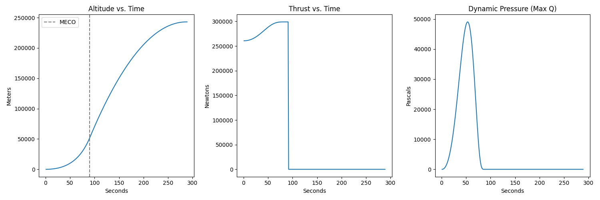

# flight-dynamics

Flight dynamics simulator written in Python. Use for simple single-stage rockets (such as a hobby rocket).

---

# How It Works

- Implements NASA's [Isentropic Flow](https://www.grc.nasa.gov/www/k-12/airplane/isentrop.html) equations.
- A propellant class and an engine class calculate the thrust and geometry of the required engine.
- Includes graph visualisation for altitude, thrust and dynamic pressure to visualise your rocket's flightpath.
  

---

# Physics

The system estimates for the Mach number using the Newton-Raphson method. The Area-Mach relation equation is as follows:

$$\frac{A}{A^*}=\frac{1}{M}\left[\frac{2}{\gamma+1}(1+\frac{\gamma-1}{2}M^2)\right]^{\frac{\gamma+1}{2(\gamma-1)}}$$

Where $\gamma$ is the ratio of specific heats of the liquid propellant. The ratio shows that there are two solutions, 
one subsonic and one supersonic.

---

# Historical Simulations

| Rocket | Fuel                        | Graph                                       |
|--------|-----------------------------|---------------------------------------------|
| V2     | B-Stoff (3:1 Ethanol:Water) |  |

---

# Tech Stack

- Languages used: Python
- Frameworks/libraries: matplotlib

---

# What I Learned

- Python OOP
- Translating equations into code
- Numerical Methods
- Aerospace Engineering principles

---

# Project Structure

```
├── README.md
├── data.py
├── engine.py
├── engine_math.py
├── images
│   ├── flight_20260308-235112.png
│   └── latest.png
├── main.py
└── requirements.txt
```

# How to Run the Project

```bash
git clone https://github.com/yourusername/flight-dynamics.git
pip install -r requirements.txt
python main.py
```

# Future Improvements

- Implement a propellant dataset so hard-coded values are not necessary. Many simulations can be run with varying
propellants to see the most effective for your rocket setup.

---

# AI Usage Disclosure
The use of the generative AI tool Gemini 3 Fast/Pro was used in this project for consultation only. No code in this
project was created by AI.